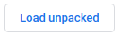

# Click-In-Text-Chrome

Adapted from [TransOver](https://github.com/artemave/translate_onhover), the amazing chrome extension under MIT license

If you don't know much about chrome extensions: \
Read [google extension official overview](https://developer.chrome.com/extensions/overview) to know the basic relationship of the files.
Specifically `contentscript.js` `background.js`.

## Install

Under project root directory

- `yarn`

## Directory Structure

##### What's compiled by webpack and goes into zipped build

`./src/icons`: Icon of this extension in different resolution. Check `./icons/README.md` for how to generate icons.

`./src/lib`: Core Javascript code that are reusable (browser invariant). 
ECMAScript Module is used.

`./src/browser/background.ts` `./src/browser/contentscript.ts` `./options.html`: Chrome-extension specific files

##### Others

`./libexec`: build/dev scripts. Node scripts are preferred over shell script for cross-platform compatibility. 

`./src/embedded/test.html`: Test page for cypress to test the UI of the extension.

`./src/test.ts`: Test script that goes with `test.html` to make sure core javascript code and can be thoroughly tested. 
It basically mocks the functions in `contentscript.ts` and `background.ts` to run the plugin.

### why `./src/test.ts`

We use cypress to do integration tests,
while it's not possible to test the plugin's UI as a specific browser plugin as cypress lacks the access to their API.
For example in cypress you can't detect plugin menu on the upper right side of Chrome.
You can't open `options.html` as a chrome plugin settings page 
because it's not possible for cypress to click on the menu nor get the url of the page 
(which is allocated by chrome and only accessible through chrome API `getURL`, 
the `crhome://extensions/safdjsaifjg/options.html` url you'll see in the browser is understood
 and routed by chrome and it's not possible to visit inside cypress)
 
`test.ts` mocks the browser apis to make the extension code work embedded on a web-page.

## Development Routine

1. `yarn dev` (This will watch file changes and repack everything to `./dist` upon file change)

2. Write some bugs. Files will be regenerated in `./dist`

3. Test as embedded javascript: Make sure you have disabled this extension on your browser. `yarn test` to run cypress tests. (It uses `test.html` `test.ts` and runs the extension code as embedded javascript, as explained earlier)

4. (Optional) Manual Testing as an extension: Make sure you have installed the extension in development mode as instructed below. The installation only needs to be done once for any browser. Create any new tab or reload an existing tab to test the changes you just made.

5. Go back to 2. Write more bugs.

Pro tips/Notes:

- You can `npx cypress open` and do everything in cypress built-in chrome. Everything will be the same plus at Step 3 You can use
cypress testing UI and make everything faster by omitting the need to restart a browser.

- As explained earlier. Cypress test at Step 3 tests the extension code as embedded javascript enabled by `test.ts`. Depending on the consistency between `test.ts` and browser API behaviors. Cypress may go through a 
 different user experience than what a real user would go through via a browser extension. 
 You may want to do manual testing now and then to really find out.

- If you frequently do manual testing, step 5 and 6 of going to a different tab to refresh extension and going back to reload page may be exhausting. Use 
this chrome extension as a development tool in your browser.
https://chrome.google.com/webstore/detail/extensions-reloader/fimgfedafeadlieiabdeeaodndnlbhid?hl=en This extension provides
a fake url `http://reload.extensions`. You can visit this url on any tab to reload your extension and reload the tab at one go.

(FYI, if you use cypress browser. Downloaded extensions do persist with your cypress browser over cypress restarts
 so you don't need to worry about re-downloading the tool)

## Install dev

1. On the browser, go to `chrome://extensions`. Toggle on developer mode . This enables
you to load local unzipped directories as chrome extensions.

2. Click on "Load unpacked"   and choose the generated `./dist` directory.
This loads the code generated in `./dist` as a chrome plugin.

## Linter

run `yarn run lint` or `yarn run lint-fix` under project root. 

We also have a Github action that runs `yarn run lint-fix` and commits automatically to enforce formatting.

> Just let `yarn` scripts do the work. Do not run `eslint` yourself, it by default only lints `.js` files but not `.ts` files [and it's not configurable through
eslintrc](https://github.com/eslint/eslint/issues/11223).

## Embedded version 

We publish embedded version on npm with `npm publish`. With our `.npmignore`, only `dist/embedded.js` is published.

Other website maintainers can include this one liner in their HTML and get click-in-text on their page:
 
``

More todo:

Do we need an option/configuration page in this embedded version? Current chrome extension supports configuration by
a chrome proprietary menu, where you can set things like `translation delay`, `translation key - alt/ctrl`, `hover or click` etc.

If we do need a option page for embedded version, in what form do we present the options page? I think a hovering widget
is ideal.

## Todo: Adapt to multiple browsers

Seems like there are ways to write a cross-browser extension in one codebase, 
see more at Mozilla's [Build a cross browser extension](https://developer.mozilla.org/en-US/docs/Mozilla/Add-ons/WebExtensions/Build_a_cross_browser_extension)
